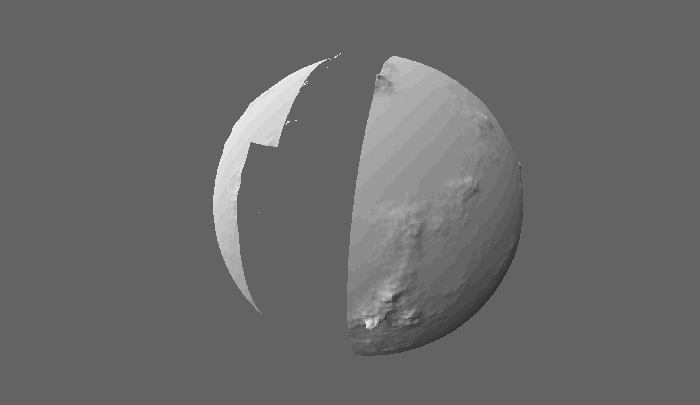
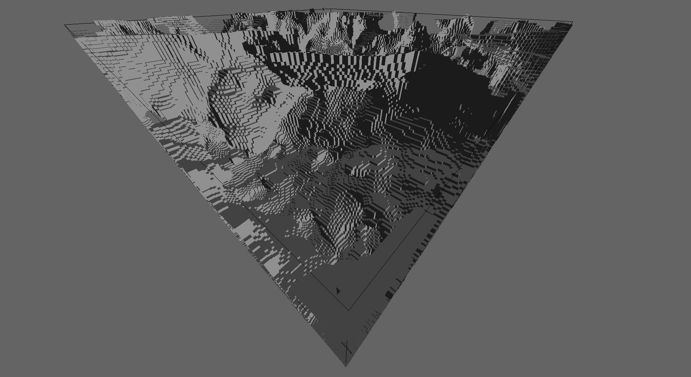

# SGAL V0.1.2
The **S**imple **G**raphics and **A**udio **L**ibrary is a straight-forward object-oriented library built in C++ meant to give the user a streamlined way of creating robust 3D graphics through a simple and small API. It uses OpenGL for the low-level rendering operations, and all window handling is done in-framework. It is cross platform.

All dependencies are automatically downloaded and synced when you compile using CMake.

### Links
Github: [Link](https://github.com/maxortner01/SGAL/)

##### Relevant Links
GLEW: [Link](https://github.com/nigels-com/glew)

CMake: [Link](https://cmake.org/download/)

## What's New in `0.1.1`

This version is powered by the new `VertexArray` object which allows you to generate meshes without pushing anything to the GPU. This means you can generate meshes on another thread in your RAM and when its finished, push it to your graphics card and start rendering. An instance of this can be shown in the new demo project `marching-cubes`.

There's also the introduction of the `Primitives` system. Before you compile, if python is installed, the binary files within the `prims` folder will be converted into byte-arrays into a `Primitives.cpp` file which allows you to access these primitives directly from the framework. If python isn't installed, it still compiles, just without the primitives. Now you can render cubes or planes, build meshes out of cubes or planes and never have to load in any files.

## Compilation

SGAL uses `cmake` to compile. It needs a `build` folder and `lib` folder. Change your directory to the build folder and run `cmake ..` (with your additional parameters if needed) and it should get to work compiling the library. All files needed for linking will be found in the `lib` folder, and if you don't want to compile the client application simply disable the `COMPILE_CLIENT` option in CMake.

### Dependencies
SGAL uses only the `GLEW` library as a dependancy. For now it pulls from the `cmake-glew` repository since it includes the `glew.c` file which is needed for easy compilation until I can figure out the official repo.

## Changelog

### Version `0.1.2` - 8/30/2020

 - Implemented Animation, AnimationSequence, and AnimationSystem
 - Fixed small bugs

### Version `0.1.1` - 5/6/2020

- Introduced the VertexArray.
- Created the SingleModel class.
- Bug fixes.
- Introduced primitive system and header generation.
- Made the application folder more robust.

#### Planned Features

- [ ] Add assimilate feature to VertexArray where it combines vertices with the same position.
- [ ] Text rendering.
- [ ] Orthographic projection.

### Version `0.1` - 4/29/2020

- Complete rewrite.
- Foundation for UI rendering.
- Now does in-house window handling. Right now it only supports windows, I will do an X11 implementation soon.
- Basic serialization so you can generate RawModels and write/read them from files.
- In-house shaders for 2D and 3D rendering.
- Supports multiple framebuffers.
- Each render takes a different context, meaning you can change cameras and render with different lights.
- Architecture looks prettier.

#### Planned Features

- [X] ~~SingleModel class that represents a RawModel and Model in one fell swoop.~~
- [ ] Actual documentation.
- [ ] Vulkan instead of OpenGL.
- [ ] X11 implementation.
- [ ] Normal maps and more PBR-like lighting calculations.

## Projects

Here we're using mesh generation to generate a single RawModel that represents about 505,000 cubes from perlin noise. It generates in a couple of seconds and runs faster than 60 FPS.

## Author

Max Ortner